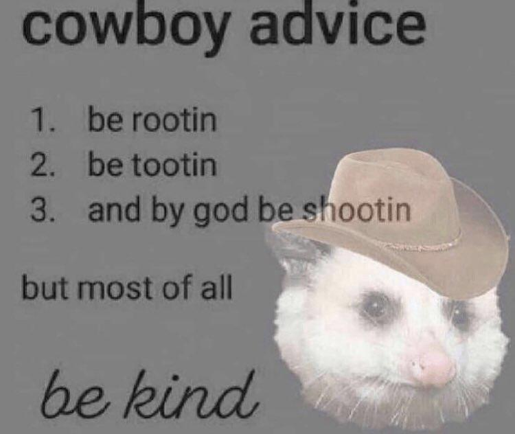

# project-prep
Project prep for Code 201 final project

## Members: 
- [Jeffrey Jenkins](https://github.com/orgs/lausl-makins/people/jeffreyjtech)
- [Liesl White](https://github.com/orgs/lausl-makins/people/LieslW)
- [Lauren Murphy](https://github.com/orgs/lausl-makins/people/L-nobilis)
- [Michael Maker](https://github.com/orgs/lausl-makins/people/guerillaxgardener)

## Mission Statement

- What are the key strengths of each person on the team?
  - Jeffrey: Quick learner, adaptable
  - Michael: Adaptable, good with communcation, produces quality work
  - Liesl: Adaptable, quick learner, organized
  - Lauren: Flexible, quick learner, enthusiatic/positive
- How can you best utilize these strengths in the execution of your project?
  - We can utilize our communication skills if any problems arise and adapt to our solution. We'll be able to quickly change direction if something's not working. We can support and help each other through difficult tasks. 
- In which professional competencies do you each want to develop greater strength?
  - Jeffrey: Handling ambiguity, planning, self-confidence
  - Michael: Mission and vision alignment; planning
  - Liesl: Handling ambiguity, asking for help
  - Lauren: Planning, working in an organized manner
- Knowing that every person in your team needs to understand all aspects of the project, how do you plan to approach the day-to-day work?
  - We will divide up our project's various features and communicate with each other regarding our progress.  

## Conflict Plan
Your team should agree on a process for handing disagreements, should they arise. It is better to have a plan in place ahead of time so you can all refer back to it when necessary.

Describe at least:

- What will be your group’s process to resolve conflict, when it arises?
  - We will establish open feedback between group members, opening up a full group discussion every day where members can freely give and receive feedback.  This open discussion will allow us to be familiarized with other members' contributions.  We also intend to do a mini code review at the beginning of the day, and at other points throughout the day. 
- What will your team do if one person is taking over the project and not letting the other members contribute?
  - We'll bring up concerns over this as it arises and reorganize work as necssary.  Regular check-ins will help mitigate uneven workload balance. 
- How will you approach each other and the challenges of the project knowing that it is impossible for all members to be at the exact same place in understanding and skill level?
  - By treating each other with kindness and empathy, we will keep in mind that we have different backgrounds, strengths, and situations.  All our members intend to help other members who may be having a hard time with certain topics. 
- How will you raise concerns to members who are not adequately contributing?
  - We'll assume the best intentions and try to address what's occuring that's leading to their inadequate contributions, and try to form a game-plan to address it. 
- How and when will you escalate the conflict if your resolution attempts are unsuccessful?
  - If we cannot solve an issue internally, we will talk to our instructor (Audrey P.) as soon as we need to.  Because all members of our group are on equal footing, no one member has positional authority over group.

## Communication Plan

Before beginning to tackle the project, determine how your group will communicate with each other. This is not an individual effort. Make sure everyone feels comfortable with the identified methods of speaking up.

Describe at least:

- What hours will you be available to communicate?
  - Monday - Friday:  9 am - 5 pm 
  - Weekends: Not guaranteed
- What platforms will you use to communicate (ie. Slack, phone …)?
  - Slack, Remo 
- How often will you take breaks?
  - Lunch break 12 - 1, 10 minute break at the top of every hour
- What is your plan if you start to fall behind?
  - Members will communicate with other groupmates as soon as possible, and request help if need be.  We'll ask TAs or other staff for help if necessary. 
- How will you communicate after hours and on the weekend?
  - Casual questions or basic pointers are fine, but members should not necessarily expect a reply before work hours resume. 
- What is your strategy for ensuring everyone’s voice is heard?
  - Daily check-ins and consciously making sure to pull in group members who are participating less. 
- How will you ensure that you are creating a safe environment where everyone feels comfortable speaking up?
  - We'll be sure to dedicate some time to talk about how our days or lives are going before we dive into our code.  A respectful and kind atmosphere will be maintained.

## Work Plan
Explain your work plan to track whether everyone is contributing equally to all parts of the project, and that each person is working on “meaty” problems. This should prevent “lone wolf” efforts and “siloed” efforts.

NOTE: While researching and experimentation is always encouraged, writing and/or committing code to the project on your own during non-working hours or over the weekend is never acceptable. This puts the entire project at risk. Be explicit in calling out your work hours and the distribution of tasks.

Describe at least:

- How you will identify tasks, assign tasks, know when they are complete, and manage work in general?
  - We'll develop our MVP with some brainstorming and define the goals we need to reach it.  We will make a simple problem domain graph. These goals can be organized and tracked in GitHub's Project interface, which we'll be consistently checking to observe group progress and ensure completion. 

- What project management tool will be used?
  - GitHub Projects

## Presentation Deck

Make a single copy of the Presentation Deck Template. Share your copy will all team members, so everyone is working from the same file.

Link to the shared doc in your project plan.
  - https://docs.google.com/presentation/d/13zm5SgmJowCyFgvZePAQbv5SzaJWISY-wKtU0BtWIHw/edit?usp=sharing

## Git Process
Plan out what your team’s Git workflow looks like for coding tasks.

Describe at least:

- What components of your project will live on GitHub?
  - All the code
  - All the assets
  - Wireframe
  - Planning documents
  - ReadMe
- How will you share the repository with your teammates?
  - https://github.com/lausl-makins
- What is your Git flow?
  - Do not commit to main without discussing it with the whole group. 
  - Members will have separate branches
  - Merge parties to merge branches and deal with conflicts
- Will you be using a PR review workflow? If so, consider:
- How many people must review a PR?
  - Two
- Who merges PRs?
  - A group memeber who did **not** contribute code to the PR.
- How often will you merge?
  - End of day, and whenever group members agree it is necessary.
- How will you communicate that it’s time to merge?
  - We will discuss this as a group and make sure all  members know we are going to merge. 
